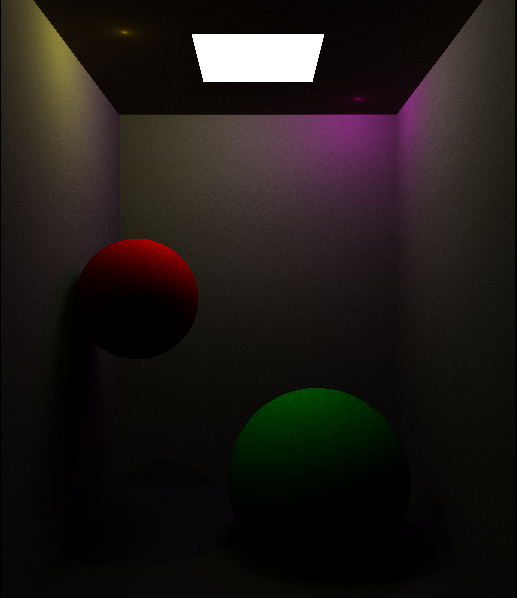
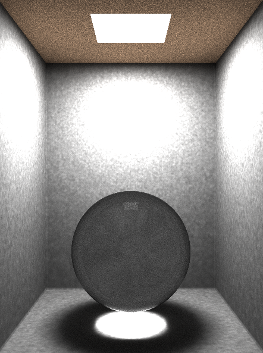
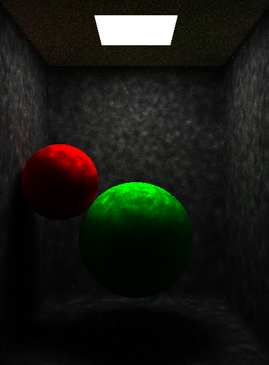
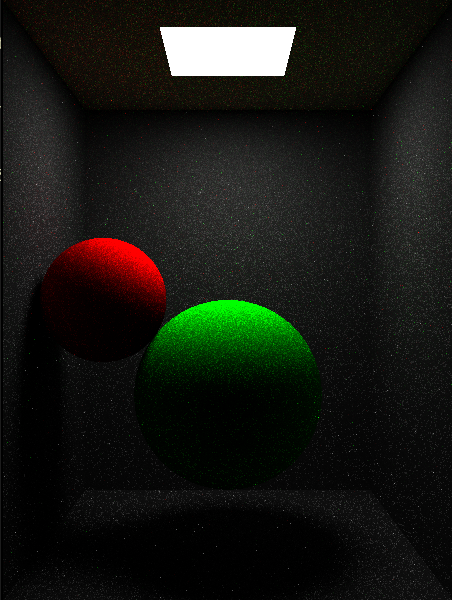

A simple pathtracer.

First render:

Comparing standard path tracing with photon mapping:

Standard path tracing:

Photonmap:

Care has to be taken with how lights are sampled (directly or indirectly),
as well as how photons are shot and how much energy each photon has for
the two methods to converge to the same result.

